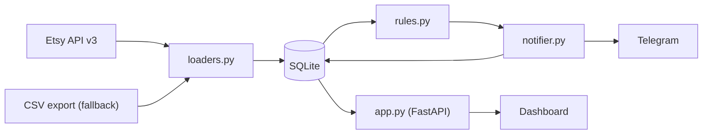

# ShopWatch

[](https://github.com/GhaithKelil/shopwatch/actions/workflows/ci.yml)


Order monitoring for Etsy sellers. ShopWatch pulls your orders from the Etsy API (or from a CSV export), checks them against a set of problem rules, and tells you when something needs attention: an order that has not shipped, a shipment with no tracking number, a spike in refunds. Alerts go to Telegram and to a small web dashboard. It works for one shop or several.

## What it checks

| Rule | Severity | Fires when |
| :--- | :--- | :--- |
| Late unshipped | Critical | A paid order is still unshipped after 3 days |
| Missing tracking | Warning | An order is marked shipped but has no tracking number |
| Stuck in transit | Warning | An order shipped more than 14 days ago and has no tracking number |
| Refund spike | Critical | More than 10% of a shop's orders in the last 30 days were refunded or cancelled |
| Buyer velocity | Warning | The same buyer places 3 or more orders within 24 hours |
| Sync stale | Critical | No successful sync in the last 2 hours |

All thresholds are settings in `.env`. Etsy does not report delivery, so "stuck in transit" can only flag shipments you have no way to follow. A tracked parcel never triggers it.

Alerts are de-duplicated: an open alert is sent once, and it closes itself when the problem goes away (the order ships, tracking is added, and so on). You can also resolve alerts by hand on the dashboard.

## How it works



- `scheduler.py` is the worker. Every 15 minutes it fetches orders, runs the rules and sends new alerts.
- `app.py` is the web server: the dashboard at `/` and a JSON API (docs at `/docs`).
- Both share one SQLite database file.

## Setup, step by step

### 1. Install

You need Python 3.11 or newer.

```bash
git clone https://github.com/GhaithKelil/shopwatch.git
cd shopwatch
python -m venv .venv
source .venv/bin/activate        # Windows: .venv\Scripts\activate
pip install -r requirements.txt
cp .env.example .env             # Windows: copy .env.example .env
```

### 2. Name your shops

Open `.env` and set `SHOP_NAMES` to your shop name, or several separated by commas:

```
SHOP_NAMES=mycoolshop
```

The names are just labels used in the dashboard and file names. Use lowercase letters and numbers.

### 3. Connect Etsy (live orders)

Skip to step 4 if you only want to use CSV exports for now.

1. Go to <https://www.etsy.com/developers/your-apps> and create an app. Etsy reviews new apps, so approval can take a while.
2. In the app settings, add this redirect URI: `http://localhost:3003/callback`
3. Copy the app's **Keystring** and **Shared secret** into `.env` as `ETSY_KEYSTRING` and `ETSY_SHARED_SECRET`.
4. Authorize each shop. This opens your browser; sign in as the shop owner and click Allow:

   ```bash
   python auth.py mycoolshop
   ```

   This saves `tokens_mycoolshop.json`. It holds a login token for your shop, so keep it private (it is already in `.gitignore`). Repeat for each shop, using the same name as in `SHOP_NAMES`.
5. Check that it works:

   ```bash
   python check_etsy.py mycoolshop
   ```

   You should see how many orders were found.

One Etsy app can be authorized for several shops, as long as you own them.

### 4. Or use a CSV export instead

If API access is not ready yet, or you just want to try ShopWatch:

1. In Etsy, go to Shop Manager, Settings, Options, Download Data, and download the **Orders** CSV.
2. Save it next to the code as `orders_mycoolshop.csv` (the shop name in lowercase). With a single shop, `orders.csv` also works.

When the API returns orders, the CSV is ignored. A CSV is only used when the API gives nothing, so you have to download a new one to refresh CSV data. Keep these files out of git; `*.csv` is already ignored because they contain customer details.

### 5. Run it once

```bash
python scheduler.py --once
```

This loads your orders, runs the rules and prints any alerts.

### 6. Open the dashboard

```bash
uvicorn app:app --port 8000
```

Go to <http://localhost:8000>. Use **Sync now** to refresh on demand. In another terminal, start the worker so it syncs automatically:

```bash
python scheduler.py
```

### 7. Get alerts on Telegram (optional)

1. In Telegram, message **@BotFather**, send `/newbot` and follow the steps. Copy the bot token.
2. Send any message to your new bot, then open `https://api.telegram.org/bot<TOKEN>/getUpdates` in a browser and find `"chat":{"id":...}`. That number is your chat ID.
3. Put both into `.env` as `TELEGRAM_BOT_TOKEN` and `TELEGRAM_CHAT_ID`, then restart the worker.

Without these, alerts still appear on the dashboard and in the logs. If Telegram is down, unsent alerts are retried on the next sync.

### 8. Run it 24/7 with Docker (optional)

```bash
mkdir -p tokens && mv tokens_*.json tokens/
docker compose up -d --build
```

The dashboard is at <http://localhost:8000>. It is bound to localhost on purpose. See the security note below before changing that.

## Configuration

Everything is set in `.env` (see `.env.example` for the full list): `SHOP_NAMES`, Etsy and Telegram credentials, `SYNC_INTERVAL_SECONDS`, and the thresholds for each rule.

## Security

- The dashboard and API have **no login**. They show buyer names and addresses. Run them on your own machine or behind something that adds authentication (a VPN, a reverse proxy with a password). Do not expose port 8000 to the internet.
- Never commit `.env`, `tokens_*.json`, CSV exports or the `data/` folder. They are all in `.gitignore`.

## Development

```bash
python -m pytest tests/ -v
```

Tests do not touch the network or your real data. The rules in `rules.py` are plain functions, so a new rule is a function plus a test with a made-up order. See [RUNBOOK.md](RUNBOOK.md) for what to do when something breaks.

## API

| Method | Endpoint | Description |
| :--- | :--- | :--- |
| `GET` | `/health` | Health check (returns 503 when the sync is stale) |
| `GET` | `/api/stats` | Order counts, open alerts, average days to ship, last sync |
| `GET` | `/api/orders` | Orders, with `shop`, `status`, `search`, `limit` and `offset` filters |
| `GET` | `/api/alerts` | Open alerts (`?all=true` for history) |
| `POST` | `/api/alerts/{id}/resolve` | Resolve one alert |
| `POST` | `/api/alerts/resolve-all` | Resolve all open alerts (optional `?severity=`) |
| `POST` | `/api/sync` | Run a sync now |

## Notes on the design

- **SQLite in WAL mode** lets the dashboard read while the worker writes. WAL is switched on once at startup, with a retry if another process holds the lock.
- **Alert de-duplication** is enforced by a unique index on open alerts, not just a check in code, so two syncs running at once cannot create duplicates.
- **Orders are keyed by (order id, shop)**, so two shops with the same order number never collide.
- **Dates** from the API (timestamps) and from CSV exports (`09/29/26`) are normalized to UTC in `loaders.py`.

## License

MIT
